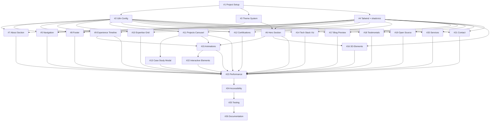

# [EPIC] Next.js Portfolio Website - Complete Redesign with AI/Tech Aesthetic

## 📋 Summary
Complete redesign and enhancement of Ronny Freites' portfolio website from basic Chakra UI implementation to a modern, futuristic AI-powered portfolio with advanced animations, multi-language support, dark/light mode, and 16 comprehensive sections showcasing professional experience, projects, certifications, and expertise.

## 🎯 Problem Statement
The current portfolio website is a basic implementation with limited functionality:
- No internationalization (English/Spanish support needed)
- No theme switching (dark/light mode)
- Limited animations and interactivity
- Missing critical sections (certifications showcase, blog preview, testimonials, tech stack visualization)
- Basic design aesthetic without modern AI/tech motifs
- Poor mobile responsiveness and accessibility features
- No performance optimizations for Lighthouse 95+ scores

## 💡 Proposed Solution
Transform the existing Next.js 15 portfolio into a comprehensive, production-ready showcase with:

### Technical Enhancements
- **i18n Implementation**: next-intl for English/Spanish with SSR support
- **Theme System**: next-themes with system preference detection
- **Animation Framework**: Framer Motion (SSR-compatible)
- **UI Migration**: Replace Chakra UI with shadcn/ui + Tailwind CSS v4
- **3D Elements**: React Three Fiber (lazy-loaded)
- **Type Safety**: TypeScript strict mode

### Design Transformation
- Minimalist futuristic aesthetic with AI/tech motifs
- Deep navy/charcoal base with cyan/purple gradient accents
- Glassmorphism effects on cards
- Custom cursor effects and micro-interactions
- Geometric shapes and gradient mesh backgrounds
- Responsive breakpoints: 640px, 768px, 1024px, 1280px, 1536px, 2xl

### Content Sections (16 Total)
1. Hero Section - Full viewport parallax with 3D elements
2. Navigation Bar - Blur effect with theme/language switchers
3. About/Intro Section - Professional identity with highlight cards
4. Expertise Matrix - Bento grid with animated tech stack
5. Experience Timeline - Vertical timeline with animated reveals
6. Featured Projects - Horizontal scroll carousel with filters
7. Case Study Modal - Deep-dive project breakdowns
8. Certifications Showcase - Masonry grid for 54+ certifications
9. Blog/Insights Preview - Card grid with categories
10. Testimonials - Auto-scroll carousel with social proof
11. Open Source Contributions - GitHub stats integration
12. Tech Stack Visualization - Hexagonal honeycomb layout
13. Services/Consulting - Engagement models with CTAs
14. Contact Section - Form + social links + availability
15. Footer - Multi-column with newsletter signup
16. Additional Interactive Elements - FAB, cursor effects, easter eggs

### Performance & Accessibility Targets
- Lighthouse score 95+ across all metrics
- WCAG 2.1 AA compliance
- First Contentful Paint <1.5s
- Time to Interactive <3s
- Cumulative Layout Shift <0.1
- Keyboard navigation support
- Screen reader optimization

## 🔧 Task Breakdown & Assignments

### Phase 1: Foundation & Infrastructure (Weeks 1-2)

| Issue | Title | Priority | Dependencies | Complexity | Estimated Time |
|-------|-------|----------|--------------|------------|----------------|
| #1 | [Foundation] Project Setup & Dependencies Migration | Critical | None | Medium | 8-12 hours |
| #2 | [Foundation] i18n Configuration with next-intl | Critical | #1 | Medium | 6-8 hours |
| #3 | [Foundation] Theme System with next-themes | Critical | #1 | Medium | 6-8 hours |
| #4 | [Foundation] Tailwind CSS v4 + shadcn/ui Setup | Critical | #1 | Medium | 8-10 hours |

### Phase 2: Core Components & Layout (Weeks 3-4)

| Issue | Title | Priority | Dependencies | Complexity | Estimated Time |
|-------|-------|----------|--------------|------------|----------------|
| #5 | [Navigation] Command Center Navigation Bar | High | #2, #3 | Medium | 10-12 hours |
| #6 | [Hero] Above the Fold Impact Section | High | #3, #4 | High | 16-20 hours |
| #7 | [About] Professional Identity Section | High | #2, #4 | Medium | 8-10 hours |
| #8 | [Layout] Footer with Multi-column Design | Medium | #2, #4 | Low | 6-8 hours |

### Phase 3: Professional Content Sections (Weeks 5-6)

| Issue | Title | Priority | Dependencies | Complexity | Estimated Time |
|-------|-------|----------|--------------|------------|----------------|
| #9 | [Experience] Career Journey Timeline | High | #2, #4 | High | 12-16 hours |
| #10 | [Expertise] Technical Arsenal Bento Grid | High | #2, #4 | Medium | 10-12 hours |
| #11 | [Projects] Portfolio Highlights Carousel | High | #2, #4 | High | 14-18 hours |
| #12 | [Certifications] Learning Showcase Masonry Grid | Medium | #2, #4 | Medium | 10-12 hours |

### Phase 4: Advanced Interactive Features (Weeks 7-8)

| Issue | Title | Priority | Dependencies | Complexity | Estimated Time |
|-------|-------|----------|--------------|------------|----------------|
| #13 | [Case Study] Deep Dive Modal System | Medium | #11 | High | 12-14 hours |
| #14 | [Tech Stack] Hexagonal Visualization | Medium | #2, #4 | High | 12-16 hours |
| #15 | [Animations] Framer Motion Integration | High | #6, #9, #11 | High | 16-20 hours |
| #16 | [3D] React Three Fiber Elements | Low | #4, #6 | High | 14-18 hours |

### Phase 5: Content & Social Proof (Weeks 9-10)

| Issue | Title | Priority | Dependencies | Complexity | Estimated Time |
|-------|-------|----------|--------------|------------|----------------|
| #17 | [Blog] Insights Preview Grid | Medium | #2, #4 | Medium | 8-10 hours |
| #18 | [Testimonials] Recommendations Carousel | Medium | #2, #4 | Medium | 8-10 hours |
| #19 | [Open Source] Community Impact Section | Medium | #2, #4 | Medium | 10-12 hours |
| #20 | [Services] Consulting Offerings Grid | Medium | #2, #4 | Low | 6-8 hours |

### Phase 6: Contact & Engagement (Week 11)

| Issue | Title | Priority | Dependencies | Complexity | Estimated Time |
|-------|-------|----------|--------------|------------|----------------|
| #21 | [Contact] Get In Touch Section | High | #2, #4 | Medium | 10-12 hours |
| #22 | [Interactive] FAB, Cursor Effects & Easter Eggs | Low | #15 | Medium | 8-12 hours |

### Phase 7: Performance & Polish (Week 12)

| Issue | Title | Priority | Dependencies | Complexity | Estimated Time |
|-------|-------|----------|--------------|------------|----------------|
| #23 | [Performance] Optimization & Lazy Loading | Critical | All sections | High | 12-16 hours |
| #24 | [Accessibility] WCAG 2.1 AA Compliance | Critical | All sections | High | 10-14 hours |
| #25 | [Testing] Cross-browser & Responsive Testing | High | All sections | Medium | 10-12 hours |
| #26 | [Documentation] Component Documentation | Medium | All sections | Low | 6-8 hours |

## 📊 Summary Statistics

- **Total Sub-Issues**: 26
- **Estimated Total Time**: 250-340 hours
- **Critical Path**: Foundation → Core Components → Professional Content → Performance
- **Timeline**: 12 weeks (3 months)
- **Team Size Recommendation**: 2-4 developers

## 🔄 Dependency Graph

## ✅ Acceptance Criteria

### Functional Requirements
- [ ] Website displays correctly in English and Spanish
- [ ] Dark/light mode toggle works seamlessly with system preference
- [ ] All 16 sections render with correct content from resume.md
- [ ] Navigation anchors scroll smoothly to all sections
- [ ] Mobile hamburger menu functions properly
- [ ] All forms validate and handle submission states
- [ ] Project filters and carousels work on all devices
- [ ] Certifications expand/collapse functionality works
- [ ] Contact form sends messages successfully
- [ ] All external links open in new tabs

### Technical Requirements
- [ ] Lighthouse Performance score ≥ 95
- [ ] Lighthouse Accessibility score ≥ 95
- [ ] Lighthouse Best Practices score ≥ 95
- [ ] Lighthouse SEO score ≥ 95
- [ ] First Contentful Paint < 1.5s
- [ ] Time to Interactive < 3s
- [ ] Cumulative Layout Shift < 0.1
- [ ] All images optimized (WebP/AVIF)
- [ ] Fonts loaded with optimal strategy
- [ ] No console errors or warnings

### Accessibility Requirements
- [ ] WCAG 2.1 Level AA compliance
- [ ] All interactive elements keyboard accessible
- [ ] Focus indicators visible on all focusable elements
- [ ] ARIA labels present on all icons and complex widgets
- [ ] Color contrast ratios ≥ 4.5:1 for normal text
- [ ] Color contrast ratios ≥ 3:1 for large text
- [ ] Screen reader tested with NVDA/JAWS
- [ ] Reduced motion preferences respected
- [ ] Skip to main content link present

### Design Requirements
- [ ] Design matches specified color palette (dark/light modes)
- [ ] Typography follows specified font families
- [ ] Spacing uses Tailwind's spacing scale consistently
- [ ] Glassmorphism effects render correctly
- [ ] Gradient animations perform smoothly (60fps)
- [ ] 3D elements load progressively without blocking
- [ ] Cursor effects work on desktop only
- [ ] Mobile touch interactions feel native

### Responsiveness Requirements
- [ ] Layout adapts correctly at 640px breakpoint
- [ ] Layout adapts correctly at 768px breakpoint
- [ ] Layout adapts correctly at 1024px breakpoint
- [ ] Layout adapts correctly at 1280px breakpoint
- [ ] Layout adapts correctly at 1536px breakpoint
- [ ] Images scale appropriately on all devices
- [ ] Text remains readable on smallest supported device (320px)
- [ ] No horizontal scroll on any viewport size

## 📝 Additional Context

### Content Source
All professional content, experience details, project information, and certifications should be mapped from `/resume.md` in the repository root.

### Design References
- Minimalist futuristic aesthetic similar to Vercel, Linear, or Stripe
- AI/tech motifs with geometric shapes and gradient accents
- Inspired by modern developer portfolios with strong visual hierarchy

### Technical Considerations
- SSR compatibility for all animations and interactive elements
- Lazy loading for heavy components (3D elements, large images)
- Progressive enhancement approach for non-critical features
- Mobile-first responsive design methodology
- Accessibility as a core requirement, not an afterthought

### Migration Strategy
1. Set up new dependencies alongside existing Chakra UI
2. Create new components with shadcn/ui + Tailwind
3. Implement i18n and theme infrastructure
4. Migrate sections one by one with feature flags
5. Remove Chakra UI dependencies after migration complete
6. Final performance optimization and testing

### Future Enhancements (Out of Scope)
- Blog CMS integration
- Admin dashboard for content management
- Analytics integration
- A/B testing framework
- Advanced SEO features (structured data, etc.)
- PWA capabilities
- Real-time collaboration features

## 🚀 Getting Started

### For Developers
1. Review this epic and all linked sub-issues
2. Set up local development environment
3. Review resume.md for content requirements
4. Start with Foundation phase (#1-#4)
5. Follow dependency graph for implementation order
6. Use feature branches for each sub-issue
7. Create PRs with screenshots/demos for review

### For Project Manager
1. Create all sub-issues using the template
2. Assign issues based on team expertise
3. Set up GitHub Projects board with phases
4. Schedule weekly sync meetings
5. Track progress against 12-week timeline
6. Review PRs for acceptance criteria compliance

## 📧 Questions & Support

For questions about this epic or any sub-issues, please:
- Comment on the specific sub-issue for technical questions
- Use GitHub Discussions for general questions
- Tag @ronnycoding for urgent clarifications

---

**Last Updated**: 2025-10-21
**Epic Owner**: @ronnycoding
**Status**: Planning
**Target Completion**: Q1 2026
